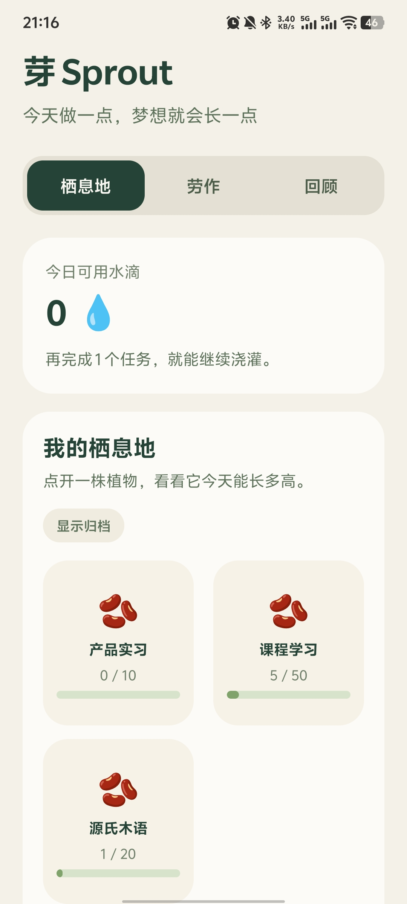
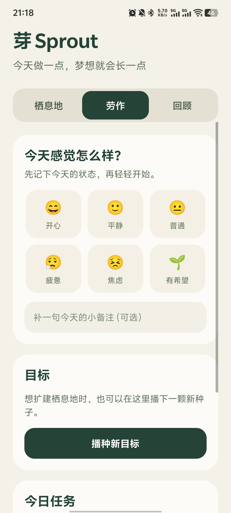
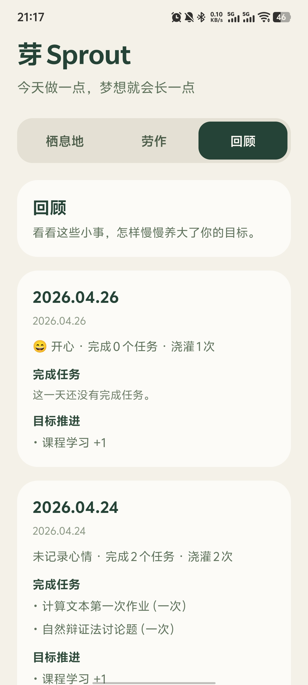
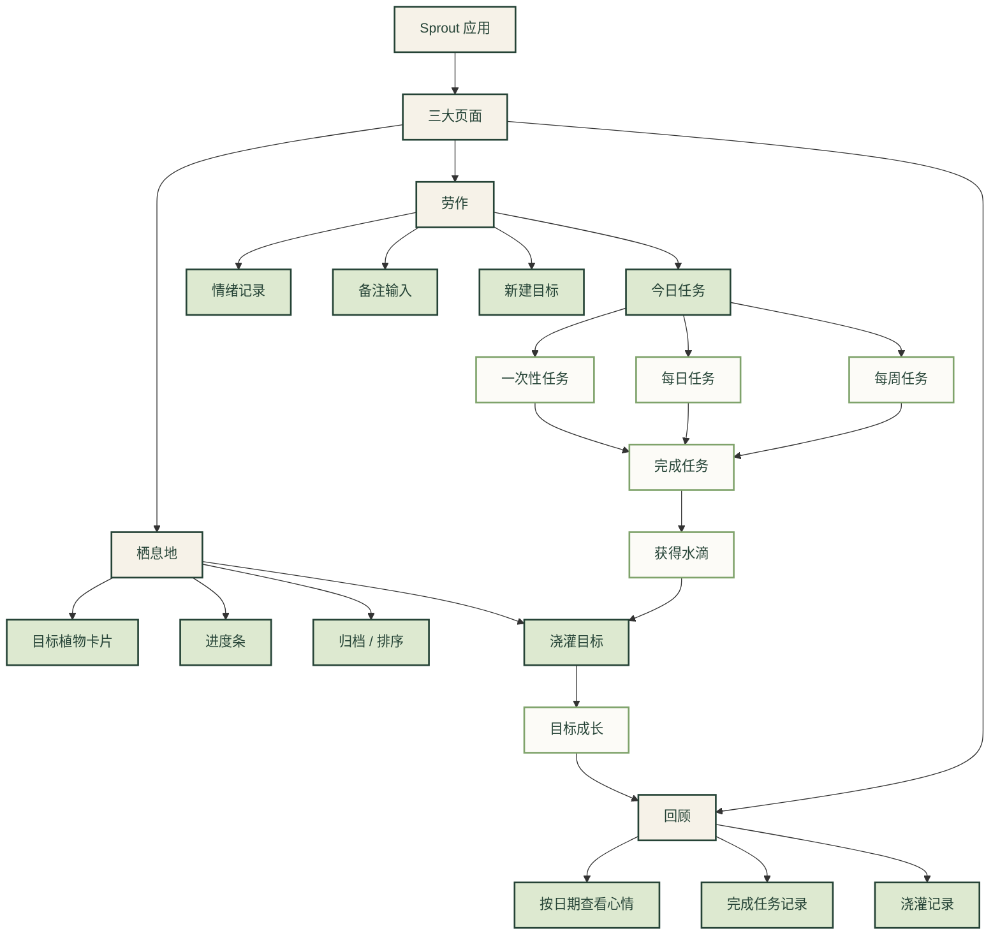
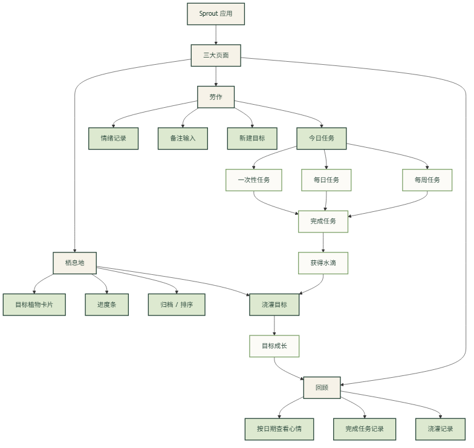
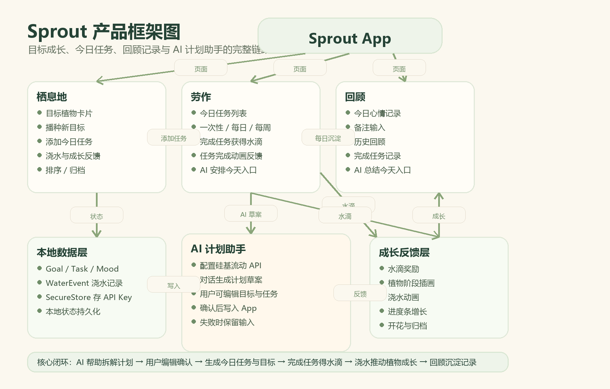

# Sprout

<p align="center">
  
</p>

<p align="center">
  一个把日常任务、情绪记录和长期目标转化为植物生长体验的治愈系 Expo 应用。
</p>

<p align="center">
  
  
  
</p>

## 项目简介

Sprout 是一个围绕“温和成长”设计的小型移动应用。

在这个应用里：
- 目标会变成一株正在成长的植物
- 完成任务会获得可以浇灌植物的水滴
- 每日情绪记录会沉淀成可以回顾的成长痕迹

它不把效率当作压力，而是尝试把进步变成一种更柔和、更可视化、也更可持续的体验。

## 应用截图

<p align="center">
  
  
  
</p>

## 功能结构图

下图展示了 Sprout 的三大页面结构，以及“任务 → 水滴 → 浇灌 → 成长 → 回顾”的核心业务链路。



如果 GitHub 对 Mermaid 渲染不稳定，也可以直接查看生成图：

<p align="center">
  
</p>

## 完整框架图

下图展示了当前版本的完整产品框架：三大页面、本地数据、成长反馈，以及新增的 AI 计划助手如何接入目标和任务系统。

<p align="center">
  
</p>

## 功能亮点

- **植物化目标成长**：把长期目标转化为植物，用可见的阶段变化展示进度
- **任务 × 水滴奖励机制**：完成任务获得水滴，再把水滴投入到目标成长中
- **AI 计划助手**：支持配置硅基流动 API，通过对话生成今日任务、拆解长期目标，并在用户编辑确认后写入 App
- **每日情绪记录**：记录当天心情，并附上一句简短备注
- **一次性 / 每日 / 每周任务**：同时支持临时任务和循环习惯
- **每日回顾时间线**：按天查看心情、完成任务和浇灌记录
- **本地离线存储**：使用 Expo 文件系统在本地保存状态，无需联网也可使用

## 体验设计

Sprout 希望传达的是一种轻量、舒缓、不施压的使用体验：

- 植物主题的视觉表达
- 更适合“小步前进”的目标管理方式
- 更关注过程感，而不是打卡焦虑
- 更适合移动端日常记录与回顾

## 技术栈

- [Expo](https://expo.dev/)
- [React Native](https://reactnative.dev/)
- [TypeScript](https://www.typescriptlang.org/)

## 快速开始

### 1. 克隆仓库

```bash
git clone https://github.com/azhan12138/sprout-app-clean.git
cd sprout-app-clean
```

### 2. 安装依赖

```bash
npm install
```

### 3. 启动开发服务

```bash
npm run start
```

如果你使用的是 PowerShell，且 `npm` 被执行策略拦截，可以改用：

```powershell
npm.cmd run start
```

### 4. 在手机上运行

- 在手机上安装 **Expo Go**
- 保证手机和电脑连接到同一个 Wi‑Fi
- 执行 `npm run start`
- 使用 Expo Go 扫描终端中的二维码

## 可用脚本

```bash
npm run start
npm run android
npm run ios
npm run web
```

## APK 下载

如果你想直接在 Android 手机上体验 Sprout，可以打开最新安装链接：

- [Expo Build 安装页面](https://expo.dev/accounts/azhan15858/projects/sprout-app-clean-v2/builds/930e2a89-eba3-470c-aae1-7140afb67cae)

安装时如果系统提示“禁止安装未知来源应用”，按系统提示临时允许安装即可。

## 项目结构

```text
.
├─ App.tsx
├─ index.ts
├─ app.json
├─ src/
│  ├─ data/
│  ├─ storage/
│  ├─ utils/
│  └─ types.ts
├─ assets/
│  └─ screenshots/
└─ figures/
```

## 当前已实现内容

当前版本已经包含：

- 栖息地页面：展示目标植物与成长进度
- 劳作页面：添加任务、完成任务、领取水滴，并展示更清晰的任务反馈
- 回顾页面：记录今日心情，并按天查看成长记录
- 目标的创建、编辑、排序、归档与浇灌
- 任务的编辑、删除与循环周期支持
- AI 计划助手：配置硅基流动 API Key 后，可生成今日计划、拆解目标、总结今天；所有草案都需要用户编辑确认后才会写入
- 移动端滚动和输入体验优化，修复劳作页、回顾页偶发滑不到底的问题

## 当前版本更新

本次版本主要更新：

- 新增 AI 计划助手入口，支持生成可编辑计划草案
- 新增硅基流动 API 配置能力，API Key 仅保存在用户本机安全存储中
- 强化任务完成、水滴奖励、浇水成长和植物阶段反馈
- 将心情记录移动到回顾页，形成更清晰的复盘流程
- 栖息地新增“添加今日任务”快捷入口
- 修复目标详情、劳作页、回顾页的多处移动端交互和滚动问题

## 为什么做这个项目

Sprout 想探索一种更柔软的自我管理方式。

它不只是一个任务清单工具，也是在尝试把“进步”变得更可见、更温和，也更愿意被长期坚持。

## 开源说明

当前仓库还没有附带 License。

如果你希望其他人可以更放心地下载、复用和二次开发，建议后续补充一个 **MIT License**。
